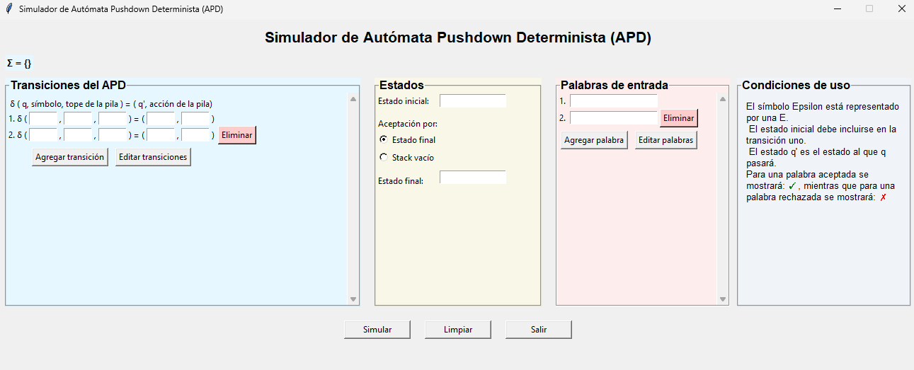
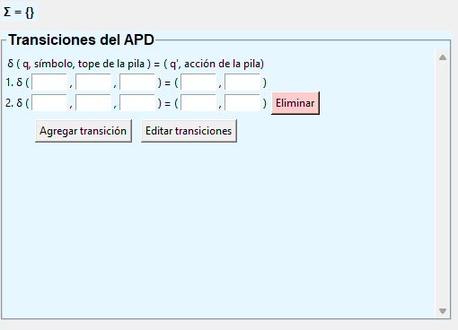
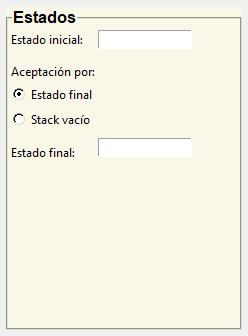
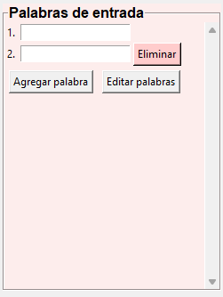
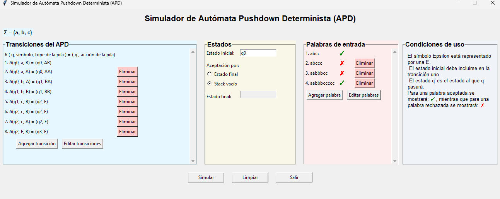

# Simulador de Autómatas Pushdown Deterministas (APD)

## Integrantes
    - Francisco Hernández
    - Ángel Leal
    - Matías Toledo

## Descripción

Un Autómata Pushdown (APD) es un modelo teórico de computación que extiende las capacidades de un autómata finito mediante la incorporación de una pila. Un APD tiene como objetivo, en la teoría de complejidad computacional, estudiar qué clase de lenguajes puede reconocer para comprender lenguajes de libre contexto (LLC), los cuales son generados mediante una gramática del mismo tipo (GLC).

Este trabajo tiene como objetivo realcionar, realizar y documentar el proceso del desarrollo de un programa capaz de simular el comportamineto de un Autómata Pushdown Determinista (APD), reconociendo si las palabras de entrada pertenecen al lenguaje definido por sus transiciones.

## Indicaciones de ejecución del programa

Al seleccionar el archivo ejecutable se abrirá el programa mostrando la interfaz gráfica con 3 secciones. 

    - La sección izquierda permite definir las transiciones del APD simulado, siguiendo el formato: δ (estado actual, símbolo a leer, tope del stack) = (nuevo estado, nuevo tope). Las transiciones serán enumeradas y se pueden agregar cuantas se necesiten, para definirlas correctamente se pulsa la tecla ENTER. En el caso de algún error a la hora de definir una transición ya guardada existe la opción para editar transiciones. 

    - La sección del medio corresponde a la declaración del estado inicial como a la forma como el autómata acepta por stack vacío o por estado final, de ser este último se solicitará ingresar el estado final del autómata. 

    - Finalmente, la sección derecha permite registrar la lista de palabras que se desean verificar atreves del autómata, enumerándose y añadiéndose a medida que se registran con la tecla ENTER. 

Luego de definir toda la entrada del autómata para ejecutar la salida se selecciona el botón de “Simular”. Para la salida, a la derecha de las palabras de entrada se mostrarán con un tick o palomilla ('✓') las palabras que sean aceptadas por el APD, mientras que para las palabras rechazadas aparecerá una equis ('X'). 

